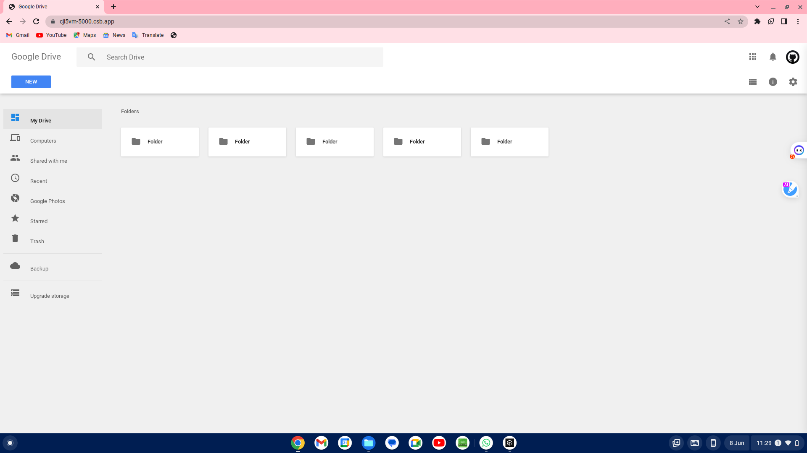

# Google_Drive_Main_Page_Interface

This is a Google Drive Main Page Interface project that replicates the main page of Google Drive, a cloud storage and file synchronization service by Google. The project aims to provide a similar user interface and visual experience to the original Google Drive web application.

## Features

- Navigation bar: The project includes a responsive navigation bar with a Google Drive logo, search functionality, and user profile avatar.
- Sidebar: A sidebar is provided for easy navigation with options to access different sections such as "My Drive," "Computers," "Shared with Me," and more.
- Folders: The main content area displays folders using card panels, allowing users to view and interact with their stored folders.
- Material Design: The project utilizes the Materialize CSS framework to achieve a clean and modern look, consistent with Google's Material Design guidelines.

## Installation

To run the Google Drive clone on your local machine, follow these steps:

1. Clone the repository: `git clone https://github.com/Sai9025/Google_Drive_Main_Page_Interface.git`
2. Navigate to the project directory: `cd Google_Drive_Main_Page_Interface`
3. Open the `index.html` file in your preferred web browser.

## Usage

Upon opening the main page, you will see a replica of the Google Drive interface. You can use the navigation bar and sidebar to access different sections of the application. Folders are displayed in the main content area, and you can interact with them by clicking or performing appropriate actions.

Please note that this project is a clone and does not provide actual file storage or synchronization capabilities. It serves as a visual representation of the Google Drive interface.

## Contributing

Contributions to this Google Drive clone project are welcome. If you encounter any bugs or have suggestions for improvements, please submit an issue on the project repository. If you want to contribute code, feel free to open a pull request after forking the repository.

Before contributing, please review the [contribution guidelines](CONTRIBUTING.md) to ensure a smooth collaboration process.

## License

This project is licensed under the [MIT License](LICENSE). You are free to modify and use the code in accordance with the terms specified in the license.

## Acknowledgements

This Google Drive clone project is a result of learning and is not affiliated with or endorsed by Google. Special thanks to the creators of the Materialize CSS framework for their valuable contribution to the open-source community.

## Disclaimer

Please note that this project is for educational purposes only and should not be used as a replacement for the official Google Drive service. The project does not provide any actual file storage or synchronization capabilities.
